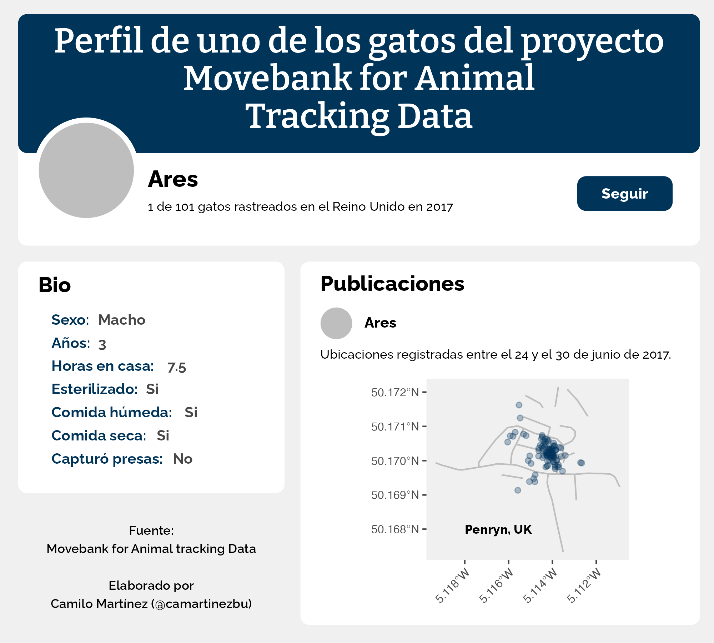
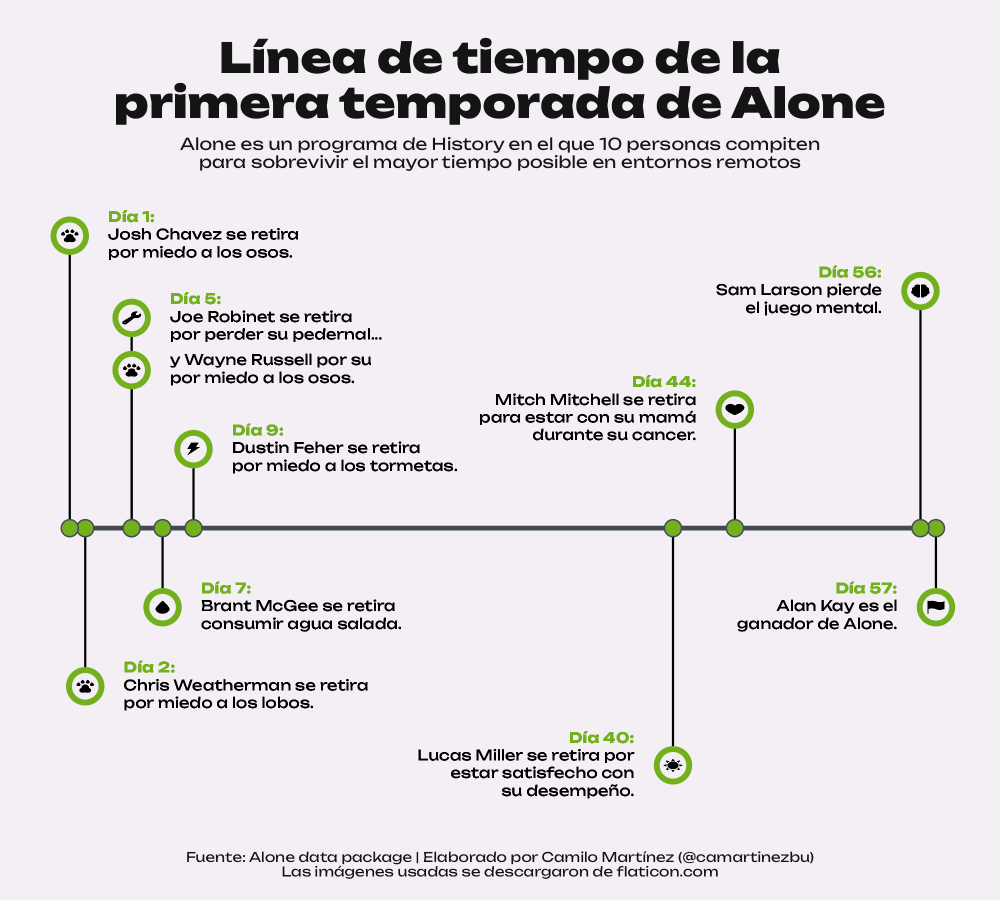
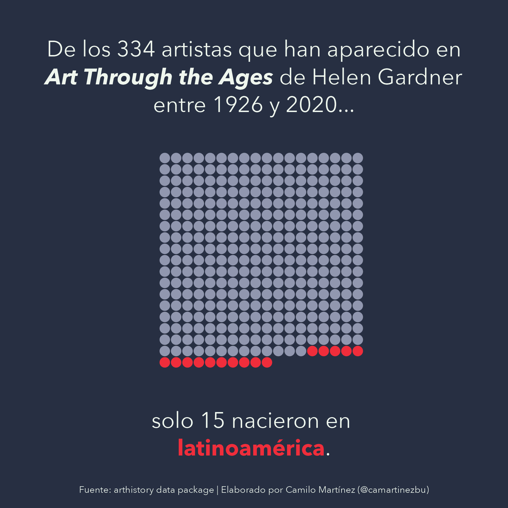
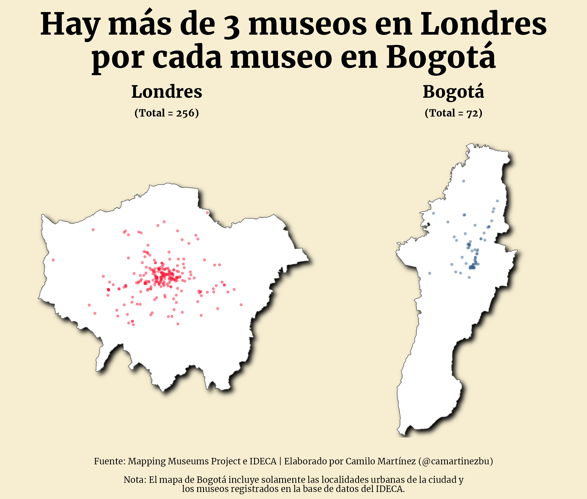
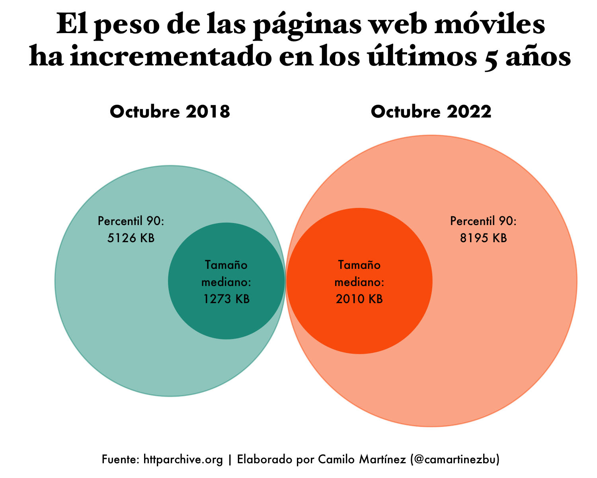
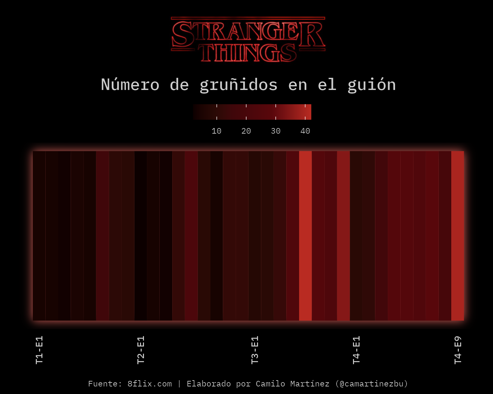

# tidytuesday
My submissions for the TidyTuesday community challenge.

## Highlights

### 2023-week 5

### 2023-week 4

### 2023-week 3

### 2023-week 2

### 2023-week 1

### 2022-week 50

### 2022-week 49

### 2022-week 47

### 2022-week 46

### 2022-week 42

### 2022-week 41

